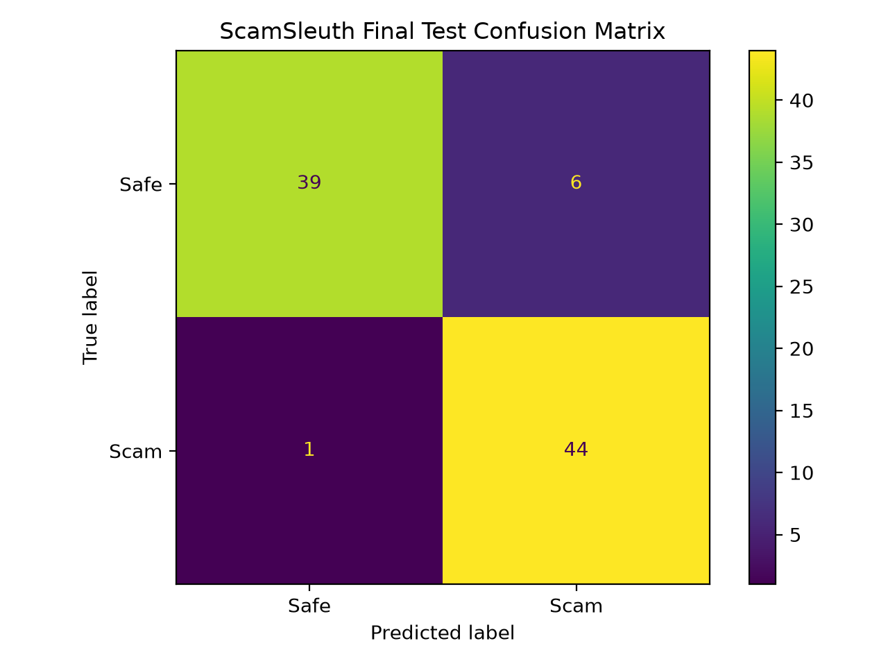
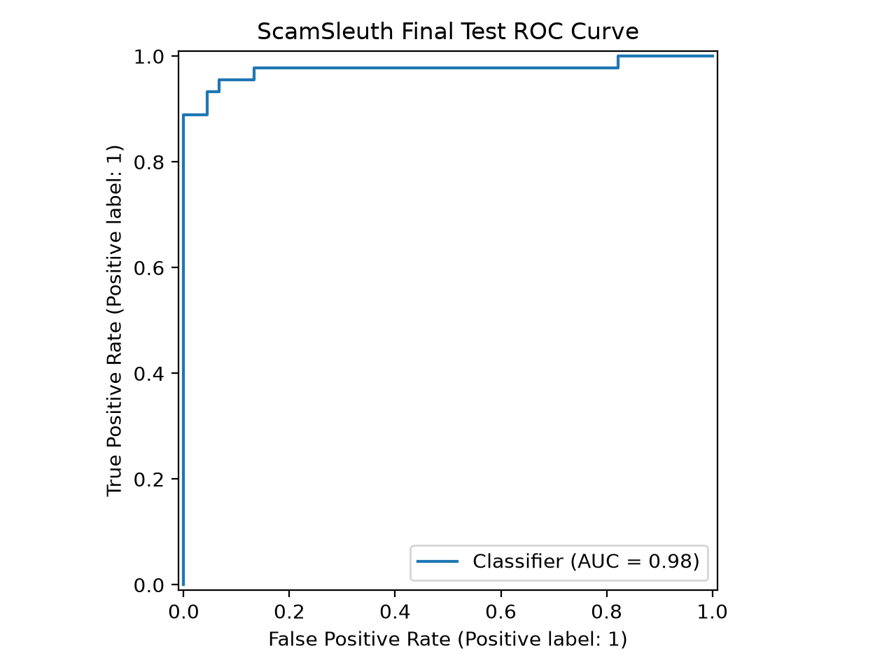
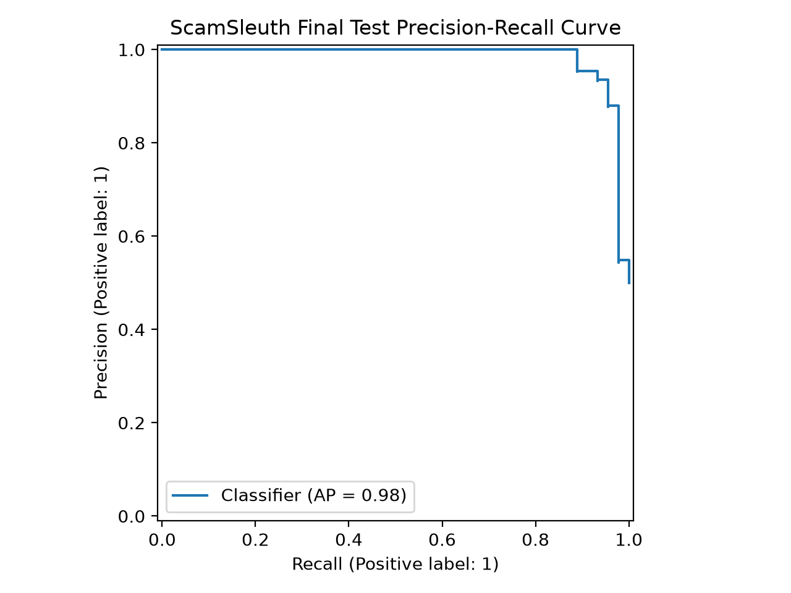
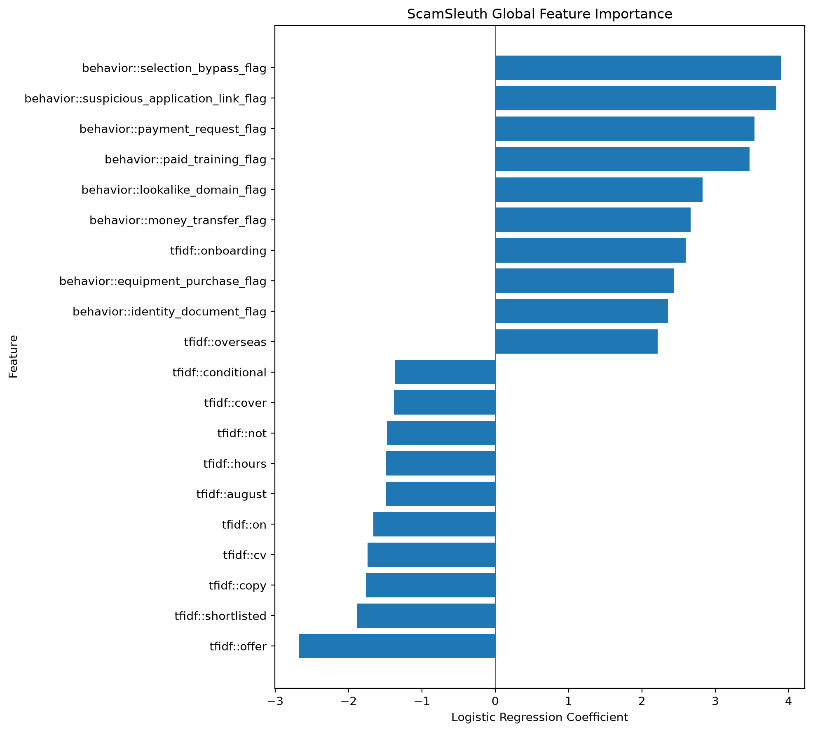

# ScamSleuth — Recruitment Scam & Phishing Text Classification

ScamSleuth is a machine-learning project for classifying recruitment-related text as either **Safe** or **Scam**.

The project focuses specifically on employment and recruitment communication, including:

- Recruiter messages
- Recruitment emails
- Job and internship postings

It combines **TF-IDF lexical features** with manually engineered **recruitment-scam behavioral features** and uses a leakage-aware evaluation workflow based on template clusters.

> ScamSleuth is a screening and educational system. A prediction should not be treated as proof that a recruitment opportunity is fraudulent.

---

## Project Objective

Recruitment scams can imitate legitimate hiring communication while attempting to obtain:

- Upfront fees
- Account credentials
- OTPs or passwords
- Identity documents
- Money transfers
- Equipment purchases
- Paid certificates or training
- Sensitive information through fake application portals
- Other improper benefits

The goal of ScamSleuth is to detect these patterns while also distinguishing them from legitimate situations such as:

- Employer-funded relocation
- Normal interviews
- Post-offer identity verification
- Legitimate training
- Normal salary information
- Standard application links

---

## Classification Definition

### Scam

A recruitment text is labeled **Scam** when it contains meaningful evidence of deceptive recruitment behavior intended to obtain money, credentials, sensitive information, identity documents, account access, illegal financial assistance, or another improper benefit.

Examples include:

- Applicant-paid recruitment or processing fees
- Fake equipment-purchase schemes
- Credential or OTP theft
- Money-mule recruitment
- Fake cheque overpayment
- Mandatory paid training or certification schemes
- Sensitive-data collection through suspicious application links
- Fraudulent visa or processing payments
- Recruitment impersonation combined with deceptive behavior

### Safe

A recruitment text is labeled **Safe** when the communication may be legitimate and does not contain sufficient evidence of deceptive or improper recruitment behavior.

A Safe example may still contain weak warning signs such as:

- Informal wording
- Gmail or messaging-platform contact
- Urgent hiring
- International recruitment
- Limited company web presence
- Requests for identity documents during legitimate onboarding
- Salary or currency references

These weak signals alone are not treated as proof of fraud.

---

## Dataset

The project uses a synthetic recruitment-focused dataset:

```text
data/raw/scamsleuth_dataset_v1.2_final.csv
```

### Dataset size

- Total examples: **600**
- Safe: **300**
- Scam: **300**

### Text types

- Message
- Email
- Job posting

Each text type contains balanced Safe and Scam examples.

### Dataset columns

```text
id
text_type
text
label
difficulty
scam_category
template_cluster
strong_signals
weak_signals
label_reason
```

Only raw `text` is used as direct model input.

Metadata such as `scam_category`, `difficulty`, `strong_signals`, `weak_signals`, and `label_reason` is used only for auditing and evaluation.

---

## Class Balance Strategy

The final dataset is exactly balanced:

| Label | Count |
|---|---:|
| Safe | 300 |
| Scam | 300 |

The leakage-aware training split is also balanced:

| Label | Training Examples |
|---|---:|
| Safe | 210 |
| Scam | 210 |

Because there was no meaningful class imbalance, techniques such as SMOTE, random oversampling, random undersampling, or class weighting were not applied.

Adding resampling to an already balanced dataset would introduce unnecessary distortion.

Class balance was instead preserved during splitting and monitored during evaluation.

---

## Leakage-Aware Dataset Split

Synthetic examples can share wording or template structure, so ordinary random row splitting could produce misleading results.

ScamSleuth therefore splits data by:

```text
template_cluster
```

No template cluster appears in more than one split.

| Split | Rows | Template Clusters |
|---|---:|---:|
| Train | 420 | 84 |
| Validation | 90 | 18 |
| Test | 90 | 18 |
| **Total** | **600** | **120** |

The split is deterministic using:

```text
random seed = 42
```

Split metadata and a platform-independent SHA-256 fingerprint of the normalized source dataset are stored in:

```text
artifacts/split_metadata.json
```

---

## Preprocessing

Text preprocessing is intentionally minimal so that potentially useful recruitment language is preserved.

The pipeline performs:

- Lowercasing
- URL replacement with `URLTOKEN`
- Email replacement with `EMAILTOKEN`
- Whitespace normalization

This avoids leaking specific domains or email addresses into the lexical model while preserving the fact that a URL or email was present.

---

# Feature Engineering

ScamSleuth evaluates three feature families:

1. TF-IDF lexical features
2. Structural features
3. Behavioral pattern features

The preferred final classifier uses:

```text
TF-IDF + Behavioral Features
```

Detailed feature hypotheses and limitations are documented in:

```text
features/FEATURE_JUSTIFICATIONS.md
```

---

## 1. TF-IDF Lexical Features

The final selected TF-IDF configuration uses:

```text
ngram_range = (1, 1)
min_df = 2
max_df = 0.95
sublinear_tf = True
```

TF-IDF captures recurring lexical patterns that may not be represented by manually engineered rules.

Lexical coefficients are statistical associations rather than universal scam indicators.

---

## 2. Structural Features

Eight structural features were implemented and evaluated:

- `word_count`
- `char_count`
- `sentence_count`
- `url_count`
- `question_count`
- `caps_ratio`
- `digit_ratio`
- `currency_reference_count`

Ablation testing showed that structural features reduced validation performance when combined with TF-IDF.

They were therefore retained as a documented experiment but excluded from the preferred final classifier.

---

## 3. Behavioral Features

The final model uses 11 binary behavioral signals:

1. `payment_request_flag`
2. `credential_request_flag`
3. `urgency_flag`
4. `identity_document_flag`
5. `equipment_purchase_flag`
6. `money_transfer_flag`
7. `paid_training_flag`
8. `suspicious_application_link_flag`
9. `selection_bypass_flag`
10. `cheque_overpayment_flag`
11. `lookalike_domain_flag`

These features represent recruitment behaviors rather than hard classification rules.

For example:

```text
identity_document_flag = 1
```

does not automatically mean Scam.

A legitimate employer may request identification during formal onboarding.

---

## Feature Leakage Safeguards

Only information derived from the raw `text` field is supplied to the classifier.

The following metadata columns are **not** used as predictive features:

```text
label
difficulty
scam_category
template_cluster
strong_signals
weak_signals
label_reason
```

These fields are retained only for:

- Dataset auditing
- Leakage-aware splitting
- Evaluation
- Error analysis

---

# Baseline Model

The first lexical baseline used:

```text
TF-IDF + Logistic Regression
```

Validation results at the default threshold of `0.50`:

| Metric | Score |
|---|---:|
| Accuracy | 0.6667 |
| Precision | 0.6667 |
| Recall | 0.6667 |
| F1 | 0.6667 |
| ROC-AUC | 0.7096 |
| PR-AUC | 0.7501 |

Confusion matrix:

```text
[[30 15]
 [15 30]]
```

---

# Feature Ablation Study

Different feature configurations were compared using the same training and validation splits.

| Feature Set | Accuracy | Precision | Recall | F1 | ROC-AUC | PR-AUC |
|---|---:|---:|---:|---:|---:|---:|
| TF-IDF only | 0.6667 | 0.6667 | 0.6667 | 0.6667 | 0.7096 | 0.7501 |
| TF-IDF + Structural | 0.6000 | 0.5882 | 0.6667 | 0.6250 | 0.6509 | 0.6633 |
| TF-IDF + Behavioral | 0.6667 | 0.8000 | 0.4444 | 0.5714 | **0.7862** | **0.8208** |
| TF-IDF + Structural + Behavioral | 0.6444 | 0.7826 | 0.4000 | 0.5294 | 0.7195 | 0.7791 |

Behavioral features produced the strongest ranking performance.

Structural features were therefore excluded from the preferred final configuration.

---

# Model Selection & Hyperparameter Tuning

Two model families were evaluated:

- Logistic Regression
- Linear SVM

Hyperparameter tuning used:

```text
StratifiedGroupKFold
```

with:

```text
n_splits = 5
```

and `template_cluster` as the grouping variable.

This keeps related synthetic variants together during cross-validation.

### Best grouped-CV results

#### Logistic Regression

```text
C = 4.0
TF-IDF min_df = 2
TF-IDF ngram_range = (1, 1)

Grouped-CV PR-AUC = 0.9302
```

#### Linear SVM

```text
C = 2.0
TF-IDF min_df = 2
TF-IDF ngram_range = (1, 1)

Grouped-CV PR-AUC = 0.9474
```

### Validation comparison

| Model | Accuracy | Precision | Recall | F1 | ROC-AUC | PR-AUC |
|---|---:|---:|---:|---:|---:|---:|
| Tuned Logistic Regression | 0.6778 | 0.8077 | 0.4667 | 0.5915 | **0.7728** | **0.8149** |
| Tuned Linear SVM | **0.6889** | **0.8148** | **0.4889** | **0.6111** | 0.7620 | 0.8108 |

Logistic Regression was selected before final test inspection because its validation ranking performance was comparable to Linear SVM and it provides native probability output, enabling deliberate threshold selection and straightforward prediction explanations.

---

# Held-Out Model Family Comparison

For final reporting, both frozen model families were evaluated on the same held-out test set using their standard decision boundaries:

- Logistic Regression: probability `>= 0.50`
- Linear SVM: decision function `>= 0`

| Model | Accuracy | Precision | Recall | F1 | ROC-AUC | PR-AUC |
|---|---:|---:|---:|---:|---:|---:|
| Tuned Logistic Regression | 0.8889 | 1.0000 | 0.7778 | 0.8750 | 0.9753 | 0.9838 |
| Tuned Linear SVM | **0.9000** | **1.0000** | **0.8000** | **0.8889** | **0.9812** | **0.9859** |

Linear SVM achieved slightly stronger held-out test metrics under the default decision boundaries.

However, this comparison was performed only after the model-selection process had already been frozen. It was **not** used to change the selected final model.

Logistic Regression remained the preferred operational model because:

- it was selected using validation evidence before test inspection;
- its validation ranking performance was comparable to Linear SVM;
- it provides native probability estimates;
- probability output enabled deliberate threshold selection;
- its coefficients support straightforward global and individual explanations.

The comparison results are also saved in:

```text
reports/model_comparison_test.csv
```

---

# Decision Threshold Selection

The default probability threshold of `0.50` was not accepted automatically.

Thresholds were evaluated using the validation split.

| Operating Point | Threshold | Precision | Recall | F1 | F2 | FP | FN |
|---|---:|---:|---:|---:|---:|---:|---:|
| Default | 0.50 | 0.8077 | 0.4667 | 0.5915 | 0.5097 | 5 | 24 |
| Best F1 | **0.31** | 0.6939 | 0.7556 | **0.7234** | 0.7424 | 15 | 11 |
| Best F2 | 0.16 | 0.5357 | 1.0000 | 0.6977 | **0.8523** | 39 | 0 |

The final operating threshold was frozen at:

```text
0.31
```

Threshold `0.16` achieved perfect recall but incorrectly flagged 39 of 45 Safe validation examples, making it impractical.

---

# Final Test Results

After all model, feature, hyperparameter, and threshold decisions were frozen, the final Logistic Regression model was trained on:

```text
Train + Validation = 510 examples
```

and evaluated on the previously untouched:

```text
Test = 90 examples
```

## Final Performance

| Metric | Score |
|---|---:|
| Accuracy | **0.9222** |
| Precision | **0.8800** |
| Recall | **0.9778** |
| F1 | **0.9263** |
| F2 | **0.9565** |
| ROC-AUC | **0.9753** |
| PR-AUC | **0.9838** |

### Confusion Matrix

```text
[[39  6]
 [ 1 44]]
```

This corresponds to:

- True Negatives: **39**
- False Positives: **6**
- False Negatives: **1**
- True Positives: **44**

The final operational model correctly detected:

```text
44 / 45 Scam examples
```

on the frozen test split.

Because the dataset is synthetic, these scores represent performance on the designed ScamSleuth benchmark and should **not** be interpreted as real-world recruitment-scam accuracy.

---

# Evaluation Figures

## Confusion Matrix



## ROC Curve



## Precision–Recall Curve



## Global Feature Importance



---

# Explainability

The final Logistic Regression model supports both global and individual explanations.

Positive coefficients push predictions toward **Scam**, while negative coefficients push predictions toward **Safe**.

Strong Scam-associated engineered signals included:

- `selection_bypass_flag`
- `suspicious_application_link_flag`
- `payment_request_flag`
- `paid_training_flag`
- `lookalike_domain_flag`
- `money_transfer_flag`
- `equipment_purchase_flag`
- `identity_document_flag`

Example illustrative prediction:

```text
Congratulations. You have been selected for the remote role.
Please pay the processing fee before onboarding.
```

Result:

```text
Prediction: Scam
Scam probability: 0.9284
Threshold: 0.31
```

The strongest contribution was:

```text
payment_request_flag
```

Lexical coefficients must be interpreted cautiously because individual words may reflect synthetic-dataset correlations rather than universal fraud indicators.

---

# Adversarial Stress Test

A separate 16-example adversarial stress test was created using new wording, negation, and mixed legitimate/suspicious signals.

```text
data/stress_test/adversarial_stress_test.csv
```

### Stress-Test Results

| Metric | Score |
|---|---:|
| Accuracy | 0.6875 |
| Precision | 0.6364 |
| Recall | 0.8750 |
| F1 | 0.7368 |

Confusion matrix:

```text
[[4 4]
 [1 7]]
```

The lower adversarial score highlights important limitations not visible from benchmark test performance.

The stress test was used for robustness analysis only. The frozen model was not modified after these failures were inspected.

---

# Error Analysis

The frozen final test set contained:

```text
6 False Positives
1 False Negative
```

Five of the six False Positives were difficulty-rated **Hard** examples.

The only False Negative was a visa-processing scam phrased as money reaching a personal account before an employment contract was issued.

The adversarial stress test contained:

```text
4 False Positives
1 False Negative
```

Detailed outputs are available in:

```text
reports/test_error_analysis.csv
reports/stress_test_error_analysis.csv
reports/stress_test_predictions.csv
```

Main failure modes included:

1. Threshold-borderline ambiguity
2. Negation and context limitations
3. Behavioral pattern coverage gaps
4. Dataset-specific lexical associations

---

# Known Limitations

## Negation and context

Pattern-based features may detect suspicious language even when the text explicitly rejects the behavior.

For example:

```text
Candidates are not required to buy equipment.
```

contains many of the same lexical signals as:

```text
Candidates must buy equipment.
```

The current regex feature system does not fully understand semantic negation.

## Behavioral phrasing variation

Fraudulent behavior may be expressed in wording not covered by the frozen behavioral patterns.

## Synthetic dataset

The dataset was synthetically generated and cannot represent all real-world recruitment communication.

## Small evaluation sets

Validation and test splits contain only 90 examples each, so individual predictions can noticeably affect reported percentages.

## Lexical artifacts

TF-IDF may learn dataset-specific correlations from ordinary words such as dates, locations, or recruitment terminology.

## Probability calibration

The decision threshold was selected on validation probabilities from a model fitted on the training split, while the final model was later refit on Train + Validation. Re-fitting can shift probability calibration slightly.

A stronger production workflow would select the threshold using out-of-fold development predictions before fitting the final model.

---

# Future Hardening

Potential improvements for a production-oriented version include:

- Semantic or transformer-based text representations
- More robust negation and context handling
- Character-level features for obfuscated scam wording
- Domain reputation and URL intelligence
- Larger real-world recruitment datasets
- Out-of-fold threshold calibration
- Probability calibration
- Additional multilingual recruitment examples
- Continuous adversarial evaluation
- Human-review workflows for borderline predictions

---

# Project Structure

```text
ScamSleuth/
│
├── data/
│   ├── raw/
│   │   └── scamsleuth_dataset_v1.2_final.csv
│   ├── splits/
│   │   ├── train.csv
│   │   ├── validation.csv
│   │   └── test.csv
│   └── stress_test/
│       └── adversarial_stress_test.csv
│
├── features/
│   ├── behavioral_features.py
│   ├── structural_features.py
│   ├── text_preprocessing.py
│   ├── feature_pipeline.py
│   └── FEATURE_JUSTIFICATIONS.md
│
├── models/
│   ├── train_baseline.py
│   ├── train_hybrid.py
│   ├── compare_feature_sets.py
│   ├── train_candidates.py
│   ├── compare_final_candidates.py
│   ├── select_threshold.py
│   ├── final_evaluation.py
│   ├── explain_model.py
│   ├── generate_evaluation_plots.py
│   ├── train_final.py
│   └── predict.py
│
├── evaluation/
│   ├── metrics.py
│   ├── threshold_analysis.py
│   ├── explainability.py
│   ├── stress_test.py
│   ├── error_analysis.py
│   └── plots.py
│
├── notebooks/
│   └── 01_data_exploration.ipynb
│
├── reports/
│   ├── results_report.md
│   ├── model_comparison_test.csv
│   ├── test_error_analysis.csv
│   ├── stress_test_error_analysis.csv
│   ├── stress_test_predictions.csv
│   └── figures/
│       ├── confusion_matrix.png
│       ├── roc_curve.png
│       ├── precision_recall_curve.png
│       └── feature_importance.png
│
├── artifacts/
│   ├── split_metadata.json
│   └── scamsleuth_model_metadata.json
│
├── tests/
│   ├── test_data_validation.py
│   └── test_features.py
│
├── config.py
├── split_data.py
├── create_stress_test.py
├── requirements.txt
├── README.md
└── .gitignore
```

The trained `.joblib` model is intentionally excluded from Git through `.gitignore`.

---

# Installation

Clone the repository and create a virtual environment.

```bash
python -m venv .venv
```

### Windows PowerShell

```powershell
.\.venv\Scripts\Activate.ps1
```

Install dependencies:

```bash
pip install -r requirements.txt
```

---

# Reproduce the Dataset Split

```bash
python split_data.py
```

This creates deterministic leakage-aware train, validation, and test splits grouped by `template_cluster`.

---

# Run Automated Tests

```bash
python -m unittest discover -s tests -v
```

Current test suite:

```text
23 tests
```

Expected:

```text
OK
```

---

# Train the Final Model

```bash
python -m models.train_final
```

This trains the frozen final model on 510 development examples and saves:

```text
artifacts/scamsleuth_model.joblib
artifacts/scamsleuth_model_metadata.json
```

The `.joblib` artifact is excluded from Git.

---

# Make a Prediction

Example Scam-like recruitment message:

```powershell
python -m models.predict --text "Your interview is confirmed after you pay the PKR 5000 processing fee to our coordinator."
```

Example output:

```text
Prediction: Scam
Scam probability: 0.9341
Decision threshold: 0.31
```

Example legitimate recruitment message:

```powershell
python -m models.predict --text "You have been shortlisted for a technical interview on Monday. No payment is required at any stage of recruitment."
```

Example output:

```text
Prediction: Safe
Scam probability: 0.0607
Decision threshold: 0.31
```

Predictions also display the strongest feature contributions toward Scam and Safe.

---

# Reproduce Experimental Stages

Baseline:

```bash
python -m models.train_baseline
```

Feature ablation:

```bash
python -m models.compare_feature_sets
```

Grouped model tuning:

```bash
python -m models.train_candidates
```

Frozen candidate-family test comparison:

```bash
python -m models.compare_final_candidates
```

Threshold analysis:

```bash
python -m models.select_threshold
```

Final frozen operational evaluation:

```bash
python -m models.final_evaluation
```

Explainability:

```bash
python -m models.explain_model
```

Adversarial stress test:

```bash
python create_stress_test.py
python -m evaluation.stress_test
```

Error analysis:

```bash
python -m evaluation.error_analysis
```

Evaluation figures:

```bash
python -m models.generate_evaluation_plots
```

---

# Reproducibility

Core environment used for the final project:

```text
Python 3.12.10
pandas 3.0.5
numpy 2.5.1
scipy 1.18.0
scikit-learn 1.9.0
matplotlib 3.11.1
joblib 1.5.3
```

Random seed:

```text
42
```

Final decision threshold:

```text
0.31
```

---

# Responsible Use

ScamSleuth should be treated as a **screening aid**, not an automated accusation system.

A `Scam` prediction indicates that the text resembles patterns learned from the project dataset.

Users should independently verify:

- Company identity
- Official careers pages
- Recruiter contact details
- Payment requests
- Application URLs
- Employment contracts
- Requests for sensitive information

before making a final decision.

---

## Author

**Abdullah Javed**

Data Science Internship Project — Khizex Internship Program 2026
